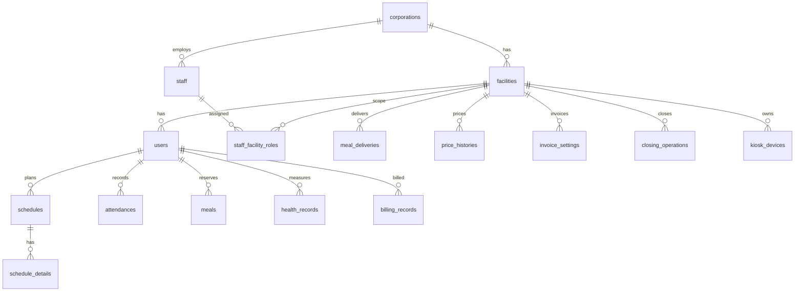

# 就労支援施設 利用者管理システム 設計書

> 作成日: 2026-07-02 / ステータス: ドラフト（実装着手前の土台合意用）
> 対象リポジトリ: `fukushi-frontend`（Vercel）／`fukushi-backend`（Cloud Run）

本書は「動く継ぎ接ぎ」だった既存実装を、**認可・マルチテナント・マイグレーション・レイヤ分離を土台から備えた本番システム**へ作り替えるための設計指針である。既存の**機能仕様・業務ルールは資産として引き継ぎ**、実装土台のみ刷新する。

---

## 1. システム概要

就労支援施設向けの利用者管理システム。3つの利用文脈を持つ。

| # | 機能ドメイン | 概要 |
|---|---|---|
| ① | 通所予定管理 | 予定登録（出席日/時間/中抜け）、通所・退所打刻、遅刻・早退・欠席の報告と管理、個々の実績把握 |
| ② | 食事管理 | 食事予約（必要日/変更/取消、締切あり）、喫食入力、食事料金の請求・管理 |
| ③ | 利用者管理 | 個人情報、通所率/遅刻早退欠席データ、食事履歴・請求金額データ |

### 1.1 利用者（アクター）と接点

| アクター | 接点 | 認証 |
|---|---|---|
| 利用者（本人） | 自宅のPC/スマホ → 個人ページ（予定申請・変更・請求書確認） | **Firebase ログイン**（合成メール＋パスワード） |
| 利用者（本人） | 施設の共用タブレット → 打刻・喫食入力・お知らせ | **PIN**（端末認証＋PIN照合→サーバー発行の操作トークン） |
| 施設スタッフ | 管理画面（今日の利用者/食事把握、スケジュール管理、申請承認、請求発行・入金管理、食事注文・納品、利用者管理） | **Firebase ログイン**（email/password） |
| 法人管理者 | 管理画面（全店舗横断） | **Firebase ログイン** |
| システム管理者（ベンダー） | 全法人横断・法人/店舗の初期セットアップ | **Firebase ログイン** |

> 重要: 1人の利用者は **1つの user レコード**を持ち、自宅からは Firebase、施設ではPINで認証されるが、サーバー側では同一 `user_id` に解決される。

---

## 2. 全体アーキテクチャ

```
                    ┌────────────────── 同一 Firebase プロジェクト（SSO の接ぎ目）──────────────────┐
                    │                                                                              │
 [ポータルシステム] ─┤ Firebase Authentication（利用者/職員/管理者の identity を共有）              │
   （別リポジトリ・  │                                                                              │
    別デプロイ）     └──────────────────────────────────────────────────────────────────────────┘
                                    ▲ IDトークン                     ▲ IDトークン
                                    │                                │
      自宅PC/スマホ ───────┐        │        施設タブレット ──────┐   │
      （個人ページ）        ▼        │        （打刻キオスク）      ▼   │
   ┌──────────────────────────────────────┐          ┌──────────────────────────────┐
   │  フロントエンド (Vercel)               │          │  端末認証＋PIN照合            │
   │  React + Vite + TypeScript (SPA)       │──────────│  → サーバー発行 操作トークン │
   │  TanStack Query / Tailwind + shadcn/ui │  REST    └──────────────────────────────┘
   └──────────────────────────────────────┘  (JSON)           │
                     │  Authorization: Bearer <Firebase IDトークン or 操作トークン>
                     ▼
   ┌──────────────────────────────────────┐
   │  バックエンド (Cloud Run)              │
   │  NestJS + TypeScript                   │
   │  - AuthGuard（Firebase Admin SDKで検証）│
   │  - TenantGuard（法人/店舗スコープ強制） │
   │  - RbacGuard（権限チェック）           │
   │  - ドメインモジュール（通所/食事/請求…）│
   │  - Prisma（型安全・マイグレーション）   │
   └──────────────────────────────────────┘
                     │
                     ▼
   ┌──────────────────────────────────────┐
   │  Cloud SQL (PostgreSQL)                │
   └──────────────────────────────────────┘
```

---

## 3. 技術スタック

| 層 | 採用 | 目的・既存問題の解消 |
|---|---|---|
| フロント | **React + Vite + TypeScript**（SPA継続） | 型安全。バックが別なのでNext.jsのAPI層は不要（二重バック回避） |
| サーバー状態 | **TanStack Query** | 「全部 useState」を廃し、取得/キャッシュ/再取得/楽観更新を一元化 |
| クライアント状態 | React Context（auth/tenant）＋最小限 | `selectedStoreId` のバケツリレーを解消 |
| ルーティング | React Router v7（現状継続） | レイアウト共有・ネストルート化 |
| UI | **Tailwind + shadcn/ui**（またはMantine） | モーダル/テーブル/カレンダー/日付関数を共通部品化しコピペ重複を根絶 |
| PDF | 請求書はサーバー側生成（後述）を推奨 | `html2pdf`＋`setTimeout`の脆い方式を廃止 |
| バック | **NestJS + TypeScript**（確定） | module/guard/DI により認可・テナント分離を「仕組みで強制」。1,838行の巨大ファイル問題を構造的に防止。開発者が素人でも「間取り（構造）」が最初から決まっており散らかりにくいため採用確定 |
| DB/ORM | **Prisma + Cloud SQL(PostgreSQL)** | **マイグレーション導入**（最大の欠陥を解消）・型安全・N+1対策 |
| 認証検証 | **Firebase Admin SDK** | サーバー側でIDトークン検証。自作JWT＋クライアント`atob`を廃止 |
| テスト | Vitest（フロント）／Jest（Nest）＋ e2e | テスト皆無を解消。認可・業務ルールを重点的に |
| CI/CD | GitHub Actions → Vercel / Cloud Run | lint・型・テスト・マイグレーションを自動化 |

> バックエンドは **NestJS で確定**（軽量な Hono 案は不採用）。理由: 認可/テナント分離を「仕組みで強制」でき、開発者が素人でも構造が崩れにくいため。

---

## 4. 認証・認可設計

### 4.1 方針（A案で確定）

- **identity（本人ログイン）は Firebase に一本化**：職員・法人管理者・システム管理者・利用者（自宅）すべて Firebase Authentication。
- **利用者はメール未確定** → Firebase には **合成メール `{login_id}@users.<ドメイン>`** で登録。利用者は login_id とパスワードだけを意識する。職員がアカウント発行・パスワードリセットを行う。
- **タブレットPINは identity ではなく「操作credential」**：共用端末で毎回Firebaseサインインし直さない。端末を1回認証し、PIN照合成功で**打刻/喫食操作だけに絞った短命トークン**をサーバーが発行する。

### 4.2 3種類の認証フロー

**(1) 職員／法人管理者／システム管理者（管理画面）**
```
ブラウザ ─ Firebase(email/pass) ─→ IDトークン取得
       ─ API: Authorization: Bearer <IDトークン>
サーバー: Firebase Admin SDKで検証 → firebase_uid → staff レコード解決
        → 所属法人・店舗・ロール・権限を DB から導出（★クライアント値は信用しない）
```

**(2) 利用者（自宅のPC/スマホ、個人ページ）**
```
ブラウザ ─ Firebase(合成メール login_id@users.<domain> ＋ pass) ─→ IDトークン
       ─ API: Authorization: Bearer <IDトークン>
サーバー: 検証 → firebase_uid → user レコード解決 → 自分のデータのみアクセス可
```

**(3) 利用者（施設タブレットで打刻）**
```
① 端末セットアップ（初回のみ）: 管理者が端末を店舗に紐付け登録 → 端末に device_token を保存
② 利用者が氏名選択 or ID入力 → PIN(4桁)入力
③ API: POST /kiosk/authenticate  { device_token, user_id, pin }
   サーバー: device_token検証（店舗特定）→ 同店舗の user の pin_code(bcrypt) 照合
           → 成功時「その user の打刻/喫食操作のみ・数分有効」の操作トークンを発行
④ 打刻: POST /kiosk/attendance/clock  Authorization: Bearer <操作トークン>
```

> PINはレート制限・試行回数ロックを設ける（既存はロックアウト無しで総当たり容易）。

### 4.3 認可（NestJS Guard 3段）

すべての `/api/*`（kiosk除く）に横断適用する。

1. **AuthGuard** … Firebase IDトークン検証。`req.principal = { firebase_uid, type: staff|user }` を確定。
2. **TenantGuard** … principal から DB を引き、**アクセス可能な法人/店舗スコープをサーバーが決定**。リクエストの対象リソースがスコープ外なら 403。クライアント送信の `corporation_id`/`facility_id` は**フィルタ条件ではなく検証対象**として扱う。
3. **RbacGuard** … エンドポイントに要求権限（例 `@RequirePermission('billing.issue')`）を宣言し、principal の権限集合に含まれるか判定。

> これにより既存の致命問題「店舗管理者が `store_id=all` を送れば全店舗を閲覧/改変できる」を根絶する。

---

## 5. マルチテナント & 権限モデル

### 5.1 テナント階層

```
corporations (法人)         ← テナント最上位
  └ facilities (店舗/施設)   ← corporation_id を持つ
      ├ users  (利用者)      ← facility_id / corporation_id を持つ
      └ staff  (職員)        ← corporation_id を持ち、店舗×ロールで割当
```

- **全業務テーブルに `corporation_id` と `facility_id` を保持**（クエリスコープを常に強制できるように）。
- 職員は複数店舗を担当しうるため、**`staff_facility_roles`（職員×店舗×ロール）** で割当を表現（例:「A店は管理者、B店は閲覧のみ」）。`facility_id = NULL` を「法人全店舗」に割当と解釈。

### 5.2 ロールと権限（RBAC）

**ロール（既定バンドル）**

| ロール | スコープ | 概要 |
|---|---|---|
| `system_admin` | 全法人 | ベンダー。法人/店舗の初期作成、システム設定 |
| `corporation_admin` | 自法人・全店舗 | 法人内すべての管理 |
| `facility_admin` | 割当店舗 | 店舗管理者。承認・請求発行・マスタ管理 |
| `staff` | 割当店舗 | 一般スタッフ。日常運用（打刻確認・食事管理等） |
| `user` | 自分のみ | 利用者本人。予定申請・請求閲覧 |

**権限（ケイパビリティ）例** — ロールに束ねる。将来は法人ごとにカスタムロール定義も可能に。

```
user.view / user.manage
schedule.view / schedule.submit / schedule.approve
attendance.view / attendance.edit
meal.view / meal.manage / meal.delivery.manage
billing.view / billing.issue / billing.payment / settings.price
health.view / health.edit
closing.manage
staff.manage / store.manage / corporation.manage
```

**権限マトリクス（抜粋・◯=許可）**

| 権限 | system_admin | corporation_admin | facility_admin | staff | user |
|---|:-:|:-:|:-:|:-:|:-:|
| schedule.approve | ◯ | ◯ | ◯ | △(設定次第) | ― |
| billing.issue | ◯ | ◯ | ◯ | ― | ― |
| billing.payment | ◯ | ◯ | ◯ | ― | ― |
| user.manage | ◯ | ◯ | ◯ | ― | ― |
| staff.manage | ◯ | ◯ | △ | ― | ― |
| corporation.manage | ◯ | ◯ | ― | ― | ― |
| （自分の予定申請） | ― | ― | ― | ― | ◯ |

---

## 6. データモデル（ER 概要）

> 命名は `snake_case`、主キーは原則 `id`（UUID or `bigserial`）。全業務テーブルに `corporation_id` / `facility_id`、`created_by` / `updated_by` / `created_at` / `updated_at` を付与。論理削除は `status` またはソフトデリート列で表現。



### 6.1 主要テーブル定義（要点）

**corporations（法人）**
`id, name, status, created_at, updated_at`

**facilities（店舗/施設）**
`id, corporation_id, name, service_type(就労移行/継続A/継続B等), email, status, remarks, ...`
- `service_type` は加算項目の適用可否に影響。

**users（利用者）**
`id, corporation_id, facility_id, login_id, firebase_uid, last_name, first_name, kana, pin_code(bcrypt), cert_number(受給者証番号), special_meal_fee, height_cm, status(利用中/退所), ...`
- 自宅ログイン=`firebase_uid`、タブレット=`pin_code`。同一レコードに両方を保持。

**staff（職員）**
`id, corporation_id, firebase_uid, last_name, first_name, email, status, ...`

**staff_facility_roles（職員×店舗×ロール）**
`id, staff_id, facility_id(NULL=法人全体), role, ...`

**kiosk_devices（タブレット端末）**
`id, facility_id, device_token(ハッシュ), label, status, last_used_at, ...`

**schedules（予定）**
`id, corporation_id, facility_id, user_id, plan_date, plan_in, plan_out, status(承認待ち/承認済/却下), note, created_by, approved_by, approved_at, ...`

**schedule_details（中抜け等）**
`id, schedule_id, event_type(中抜け/実習等), planned_out, planned_in, actual_out, actual_in, status, ...`

**attendances（打刻・実績）** ※日単位に集約
`id, corporation_id, facility_id, user_id, work_date, clock_in, clock_out, status(出席/遅刻/早退/欠席), late_flag, early_leave_flag, absence_reason, ...`
- 遅刻/早退/欠席は「予定 vs 実績」から導出。生の打刻イベントが必要なら別途 `attendance_events` を追加検討。

**meals（食事予約）**
`id, corporation_id, facility_id, user_id, meal_date, status(予約/変更/キャンセル/取消/喫食済), amount, situation, ...`

**meal_deliveries（納品）**
`id, facility_id, delivery_date, ordered_count, delivered_count, note, ...`（PK: facility_id + delivery_date）

**price_histories（料金履歴・単一の真実源）**
`id, facility_id, meal_fee, cancel_fee, effective_date, created_by, ...`
- 料金は必ずこの履歴から `effective_date <= 対象日` の最新を採用。コード内の固定値（300/450/500）は全廃。

**invoice_settings（適格請求書情報・履歴型）**
`id, facility_id, company_name, invoice_number(登録番号), postal_code, address, phone, bank_info, effective_date, ...`

**tax_settings（消費税設定・履歴型）**
`id, scope(system/corporation), corporation_id(NULL可), tax_category(standard/reduced), rate(例:0.10/0.08), price_type(内税/外税), rounding(切上/切捨/四捨五入), effective_date, created_by, ...`
- 税率は国の制度に依存するため既定は system スコープで全体管理。将来の税率改定は新しい `effective_date` の行を追加するだけで対応（過去請求は当時の税率で再計算されない）。

**health_records（体重/BMI）**
`id, user_id, target_month, weight, height, bmi, note, recorded_at, ...`（PK: user_id + target_month）

**billing_records（月次請求）**
`id, corporation_id, facility_id, user_id, target_year, target_month, meal_total, cancel_fee_total, tax, total_amount, payment_status(未入金/入金済), payment_date, note, ...`

**closing_operations（締め業務・加算実績）**
`id, corporation_id, facility_id, user_id, target_date, regional_cooperation_addition, transition_prep_addition, absence_handling_addition, ...`

---

## 7. 業務ルール（単一の真実源として集約）

既存では税率・料金・締め日が各所にコピペ散在していた。**すべて設定 or ドメインサービスに集約**し、店舗差異は `price_histories` 等のマスタで表現する。

| ルール | 内容 | 集約先 |
|---|---|---|
| 予定の自動承認 | 翌月分は当月15日までの申請なら自動承認、それ以降は承認待ち | ドメイン設定（店舗上書き可） |
| 食事の締切 | 当日 15:00 以降は変更/取消不可（要件次第で調整） | ドメイン設定 |
| キャンセル料 | 利用日の14日前以降のキャンセルはキャンセル料課金、それ以前は無料取消 | ドメイン設定＋`price_histories.cancel_fee` |
| 食事料金 | `price_histories.meal_fee`（利用者個別 `special_meal_fee` があれば優先） | マスタ |
| 消費税 | **設定で管理・履歴型**。税率/内税外税/端数処理を「いつから適用か」つきで保持。品目ごとに標準/軽減税率を選べる | `tax_settings`（マスタ、後述） |
| 加算項目 | 地域連携／移行準備／欠席時対応（店舗 `service_type` で適用可否） | ドメイン設定 |
| BMI | `weight / (height_m)^2`（サーバー計算を正とする） | ドメインサービス |

### 7.1 消費税の設計（履歴型・設定管理）

既存の `Math.floor(total - total/1.1)`（10%内税・切捨のハードコード）を廃止し、**税率変更に耐える履歴型マスタ**にする。

- **「いつから何%か」を記録**する。税率が10月に変わっても、**6月分の請求は6月時点の税率で計算**する（請求対象日 `<= effective_date` の最新を採用。料金履歴と同じ考え方）。
- 設定項目: `税率` / `内税・外税の別` / `端数処理（切上/切捨/四捨五入）` / `税区分（標準/軽減）`。
- **軽減税率対応**: 食事（食品）は日本で**軽減税率8%**の対象になりうるため、品目ごとに税区分を持てる形にしておく（標準10%・軽減8%を併存管理）。実際にどちらを適用するかは税務確認が必要（→ 13章）。

---

## 8. API 設計方針

- **REST / JSON**。ベースパス `/api`。リソース指向の命名に統一（既存の動詞混在を整理）。
- **テナントスコープは常にサーバーが決定**。一覧取得はクライアントの `facility_id` を「フィルタ」ではなく「アクセス可否検証対象」として扱う。
- **エラー形式を統一**（`{ statusCode, message, code }`）。
- **金銭・整合性が絡む処理はトランザクション**（Prisma `$transaction`。既存の `pool.query('BEGIN')` プール直叩きを廃止）。
- **一括処理はバルク化**（予定/食事の複数日登録の N+1 を解消）。
- **請求書PDFはサーバー側生成**を推奨（ヘッドレス or PDFライブラリ）。クライアント `html2pdf`＋`setTimeout` の脆さを解消。
- 破壊的な `setup-*`/`DROP TABLE` エンドポイントは**全廃**。スキーマ変更は Prisma マイグレーションのみ。

---

## 9. ディレクトリ構成（案）

**フロントエンド (`fukushi-frontend`)**
```
src/
  app/            ルーティング・レイアウト
  features/       ドメイン別（attendance / meal / billing / user / schedule / health ...）
    <feature>/    components / hooks(useQuery) / api / types
  components/ui/  共通UI（Modal / Table / Calendar / Button ...）
  lib/            apiClient(axios+interceptor) / firebase / date / format
  contexts/       AuthContext / TenantContext
  types/          共通型（APIコントラクト）
```

**バックエンド (`fukushi-backend`)**
```
src/
  auth/           AuthGuard / TenantGuard / RbacGuard / firebase
  common/         例外フィルタ / デコレータ(@RequirePermission) / パイプ
  modules/
    corporations/ facilities/ staff/ users/
    schedules/ attendances/ kiosk/
    meals/ deliveries/ billing/ pricing/
    health/ closing/
  prisma/         schema.prisma / migrations / seed.ts
  main.ts
```

---

## 10. マイグレーション & 移行方針

- **スキーマは Prisma で一元管理**。`prisma migrate` でバージョン管理し、CI/デプロイに組み込む。
- 既存 `fukushi_*` テーブルからの**データ移行スクリプト**を用意（法人レイヤーは既存に無いため、既存 store を1法人配下にマッピングして投入）。
- スキーマ乖離（`payment_date` 未定義、`daily_additions` 未作成、`stores`/`fukushi_stores` 混在、死蔵 `system_settings` 等）は移行時に整理・統合。

---

## 11. セキュリティ対策（既存の重大欠陥への対応）

| 既存の問題 | 対応 |
|---|---|
| 認可がトークン署名検証のみ／store_idクライアント依存 | Auth/Tenant/Rbac の3段Guardでサーバー強制 |
| 無認証の破壊的DDL（`GET /setup-db` で DROP） | 全廃。マイグレーションのみ |
| トランザクションがプール直叩きで無効 | Prisma `$transaction` |
| PIN総当たり容易（ロックなし） | レート制限＋試行回数ロック＋端末認証 |
| admin/user 同一JWTシークレット | Firebaseトークン検証に置換（自作JWT廃止） |
| ユーザー列挙（ログインエラー出し分け） | エラーメッセージを統一 |
| CORS 手書き | 環境変数ベースの許可リスト＋helmet 等 |
| 個人情報の平文露出（未認証の `GET /api/users`） | 端末認証済みキオスクのみに限定 |

---

## 12. 開発ロードマップ（フェーズ分け）

| Phase | 内容 | 主な成果物 |
|---|---|---|
| **0. 基盤** | リポジトリ整理・TS化・Prisma・Firebase・CI・認証/テナント/RBAC の3段Guard・共通UIキット | 空でも「安全な土台」が立つ |
| **1. マスタ＆認証** | 法人/店舗/職員/利用者マスタ、職員ログイン、利用者ログイン、タブレット端末登録＋PIN打刻認証 | ログインして各画面に入れる |
| **2. 通所** | 予定登録・変更申請・承認、打刻（キオスク）、遅刻/早退/欠席の判定と管理、当日ロースター | ①完成 |
| **3. 食事** | 予約/変更/取消（締切制御）、喫食入力、納品管理 | ②の運用部分 |
| **4. 請求** | 料金/適格請求書設定、月次請求算出、請求書発行(PDF)、入金管理、締め業務/加算 | ②の請求＋加算 |
| **5. 分析・連携** | 通所率/遅刻早退欠席/食事履歴/請求のダッシュボード、お知らせ、ポータルSSO連携 | ③完成＋ポータル連携 |

---

## 13. 未確定・要ヒアリング事項

1. **消費税の適用内容**: 仕組みは「履歴型設定」で確定。残る確認は「食事に軽減税率8%を適用するか標準10%か」「内税/外税」「端数処理」の**実運用の値**（税務確認）。
2. **食事締切**: 「15時締め」で確定か、店舗ごとに変えるか。
3. **サービス種別と加算**: 対象施設の `service_type`（就労移行/継続A/B）と、適用する加算項目の正式一覧。
4. **お知らせ機能**: タブレットに出す「個々に合わせたお知らせ」の内容・配信ルール。
5. **ポータル連携の深さ**: SSOのみか、法人/利用者データもポータルと共有するか（ポータル側データモデルの確認が必要）。
6. **利用者のログインID体系**: 受給者証番号ベースか、施設発行の連番か。

> ✅ 決定済み: バックエンドは **NestJS**。消費税は **履歴型の設定管理**（税率改定に対応）。

---

*本書は実装着手前の合意用ドラフト。確定に伴い更新する。*
